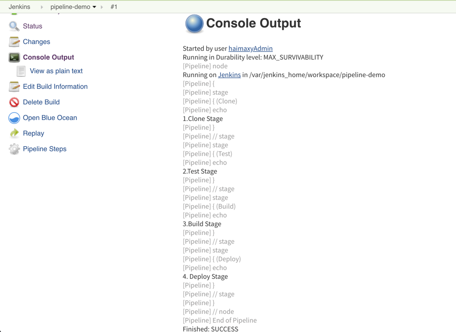
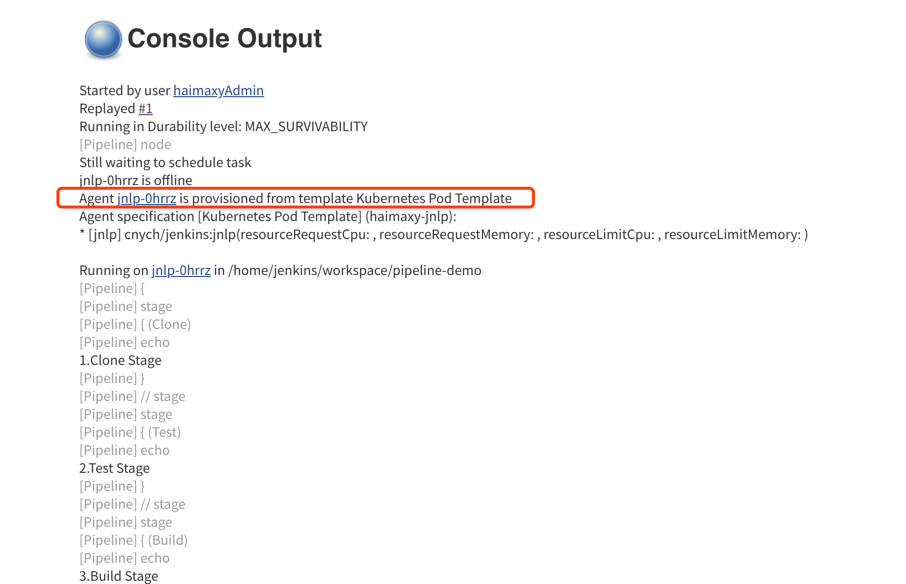
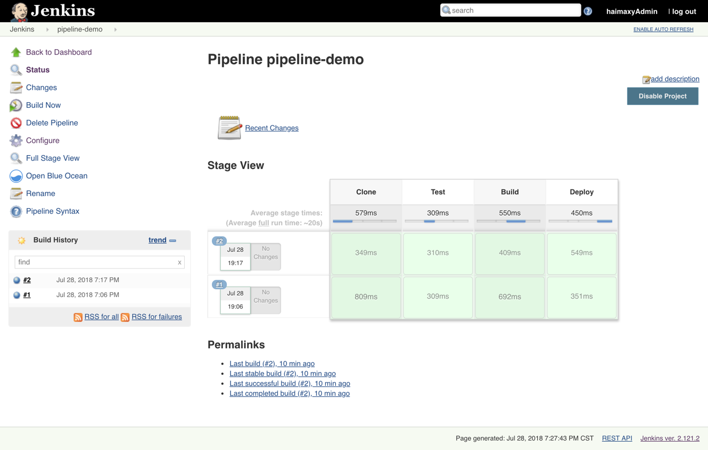
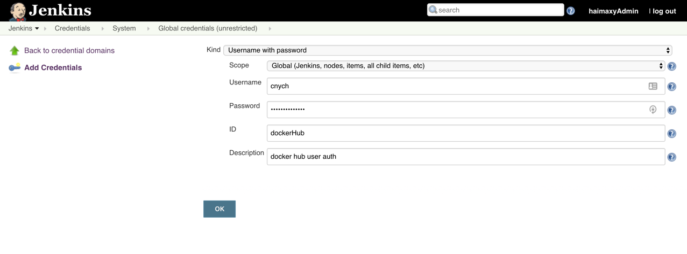
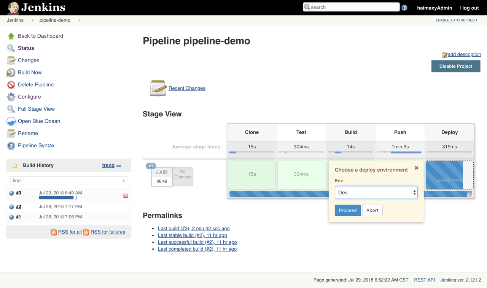
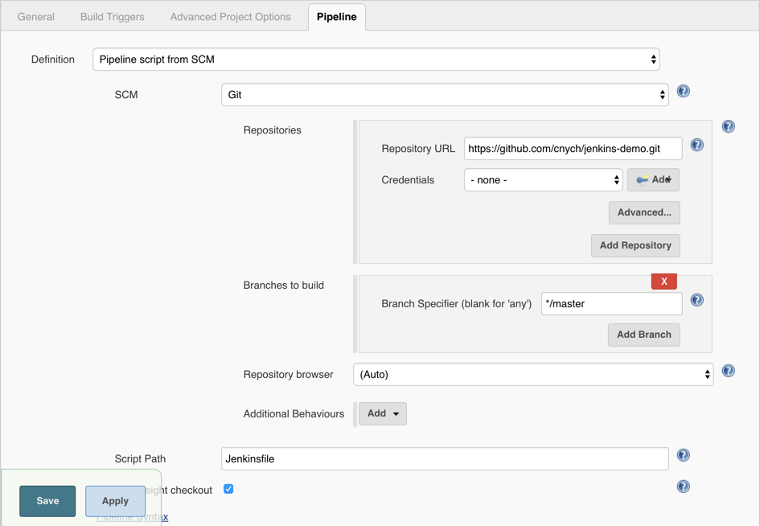

# 基于 Jenkins 的 CI/CD (二)
上节课我们实现了在 Kubernetes 环境中动态生成 Jenkins Slave 的方法，这节课我们来给大家讲解下如何在 Jenkins 中来部署一个 Kubernetes 应用。

## Jenkins Pipeline 介绍
要实现在 Jenkins 中的构建工作，可以有多种方式，我们这里采用比较常用的 Pipeline 这种方式。Pipeline，简单来说，就是一套运行在 Jenkins 上的工作流框架，将原来独立运行于单个或者多个节点的任务连接起来，实现单个任务难以完成的复杂流程**编排**和**可视化**的工作。

Jenkins Pipeline 有几个核心概念：

* Node：节点，一个 Node 就是一个 Jenkins 节点，Master 或者 Agent，是执行 Step 的具体运行环境，比如我们之前动态运行的 Jenkins Slave 就是一个 Node 节点
* Stage：阶段，一个 Pipeline 可以划分为若干个 Stage，每个 Stage 代表一组操作，比如：Build、Test、Deploy，Stage 是一个逻辑分组的概念，可以跨多个 Node
* Step：步骤，Step 是最基本的操作单元，可以是打印一句话，也可以是构建一个 Docker 镜像，由各类 Jenkins 插件提供，比如命令：sh 'make'，就相当于我们平时 shell 终端中执行 make 命令一样。

那么我们如何创建 Jenkins Pipline 呢？

* Pipeline 脚本是由 Groovy 语言实现的，但是我们没必要单独去学习 Groovy，当然你会的话最好
* Pipeline 支持两种语法：Declarative(声明式)和 Scripted Pipeline(脚本式)语法
* Pipeline 也有两种创建方法：可以直接在 Jenkins 的 Web UI 界面中输入脚本；也可以通过创建一个 Jenkinsfile 脚本文件放入项目源码库中
* 一般我们都推荐在 Jenkins 中直接从源代码控制(SCMD)中直接载入 Jenkinsfile Pipeline 这种方法

## 创建一个简单的 Pipeline
我们这里来给大家快速创建一个简单的 Pipeline，直接在 Jenkins 的 Web UI 界面中输入脚本运行。

* 新建 Job：在 Web UI 中点击 New Item -> 输入名称：pipeline-demo -> 选择下面的 Pipeline -> 点击 OK
* 配置：在最下方的 Pipeline 区域输入如下 Script 脚本，然后点击保存。
```shell
node {
    stage('Clone') {
      echo "1.Clone Stage"
    }
    stage('Test') {
      echo "2.Test Stage"
    }
    stage('Build') {
      echo "3.Build Stage"
    }
    stage('Deploy') {
      echo "4. Deploy Stage"
    }
}
```
* 构建：点击左侧区域的 Build Now，可以看到 Job 开始构建了

隔一会儿，构建完成，可以点击左侧区域的 Console Output，我们就可以看到如下输出信息：


我们可以看到上面我们 Pipeline 脚本中的4条输出语句都打印出来了，证明是符合我们的预期的。

> 如果大家对 Pipeline 语法不是特别熟悉的，可以前往输入脚本的下面的链接[Pipeline Syntax](http://k8s.haimaxy.com:30001/job/pipeline-demo/pipeline-syntax/)中进行查看，这里有很多关于 Pipeline 语法的介绍，也可以自动帮我们生成一些脚本。

## 在 Slave 中构建任务
上面我们创建了一个简单的 Pipeline 任务，但是我们可以看到这个任务并没有在 Jenkins 的 Slave 中运行，那么如何让我们的任务跑在 Slave 中呢？还记得上节课我们在添加 Slave Pod 的时候，一定要记住添加的 label 吗？没错，我们就需要用到这个 label，我们重新编辑上面创建的 Pipeline 脚本，给 node 添加一个 label 属性，如下：
```shell
node('haimaxy-jnlp') {
    stage('Clone') {
      echo "1.Clone Stage"
    }
    stage('Test') {
      echo "2.Test Stage"
    }
    stage('Build') {
      echo "3.Build Stage"
    }
    stage('Deploy') {
      echo "4. Deploy Stage"
    }
}
```

我们这里只是给 node 添加了一个 haimaxy-jnlp 这样的一个label，然后我们保存，构建之前查看下 kubernetes 集群中的 Pod：
```shell
$ kubectl get pods -n kube-ops
NAME                       READY     STATUS              RESTARTS   AGE
jenkins-7c85b6f4bd-rfqgv   1/1       Running             4          6d
```

然后重新触发立刻构建：
```shell
$ kubectl get pods -n kube-ops
NAME                       READY     STATUS    RESTARTS   AGE
jenkins-7c85b6f4bd-rfqgv   1/1       Running   4          6d
jnlp-0hrrz                 1/1       Running   0          23s
```

我们发现多了一个名叫**jnlp-0hrrz**的 Pod 正在运行，隔一会儿这个 Pod 就不再了：
```
$ kubectl get pods -n kube-ops
NAME                       READY     STATUS    RESTARTS   AGE
jenkins-7c85b6f4bd-rfqgv   1/1       Running   4          6d
```

这也证明我们的 Job 构建完成了，同样回到 Jenkins 的 Web UI 界面中查看 Console Output，可以看到如下的信息：


是不是也证明我们当前的任务在跑在上面动态生成的这个 Pod 中，也符合我们的预期。我们回到 [Job 的主界面](http://k8s.haimaxy.com:30001/job/pipeline-demo/)，也可以看到大家可能比较熟悉的 Stage View 界面：




## 部署 Kubernetes 应用
上面我们已经知道了如何在 Jenkins Slave 中构建任务了，那么如何来部署一个原生的 Kubernetes 应用呢？
要部署 Kubernetes 应用，我们就得对我们之前部署应用的流程要非常熟悉才行，我们之前的流程是怎样的：

* 编写代码
* 测试
* 编写 Dockerfile
* 构建打包 Docker 镜像
* 推送 Docker 镜像到仓库
* 编写 Kubernetes YAML 文件
* 更改 YAML 文件中 Docker 镜像 TAG
* 利用 kubectl 工具部署应用

我们之前在 Kubernetes 环境中部署一个原生应用的流程应该基本上是上面这些流程吧？现在我们就需要把上面这些流程放入 Jenkins 中来自动帮我们完成(当然编码除外)，从测试到更新 YAML 文件属于 CI 流程，后面部署属于 CD 的流程。如果按照我们上面的示例，我们现在要来编写一个 Pipeline 的脚本，应该怎么编写呢？
```shell
node('haimaxy-jnlp') {
    stage('Clone') {
      echo "1.Clone Stage"
    }
    stage('Test') {
      echo "2.Test Stage"
    }
    stage('Build') {
      echo "3.Build Docker Image Stage"
    }
    stage('Push') {
      echo "4.Push Docker Image Stage"
    }
    stage('YAML') {
      echo "5. Change YAML File Stage"
    }
    stage('Deploy') {
      echo "6. Deploy Stage"
    }
}
```

这里我们来将一个简单 golang 程序，部署到 kubernetes 环境中，代码链接：[https://github.com/cnych/jenkins-demo](https://github.com/cnych/jenkins-demo)。如果按照之前的示例，我们是不是应该像这样来编写 Pipeline 脚本：

* 第一步，clone 代码，这个没得说吧
* 第二步，进行测试，如果测试通过了才继续下面的任务
* 第三步，由于 Dockerfile 基本上都是放入源码中进行管理的，所以我们这里就是直接构建 Docker 镜像了
* 第四步，镜像打包完成，就应该推送到镜像仓库中吧
* 第五步，镜像推送完成，是不是需要更改 YAML 文件中的镜像 TAG 为这次镜像的 TAG
* 第六步，万事俱备，只差最后一步，使用 kubectl 命令行工具进行部署了

到这里我们的整个 CI/CD 的流程是不是就都完成了。

接下来我们就来对每一步具体要做的事情进行详细描述就行了：

#### 第一步，Clone 代码
```shell
stage('Clone') {
    echo "1.Clone Stage"
    git url: "https://github.com/cnych/jenkins-demo.git"
}
```

#### 第二步，测试
由于我们这里比较简单，忽略该步骤即可

#### 第三步，构建镜像
```shell
stage('Build') {
    echo "3.Build Docker Image Stage"
    sh "docker build -t cnych/jenkins-demo:${build_tag} ."
}
```
我们平时构建的时候是不是都是直接使用`docker build`命令进行构建就行了，那么这个地方呢？我们上节课给大家提供的 Slave Pod 的镜像里面是不是采用的 Docker In Docker 的方式，也就是说我们也可以直接在 Slave 中使用 docker build 命令，所以我们这里直接使用 sh 直接执行 docker build 命令即可，但是镜像的 tag 呢？如果我们使用镜像 tag，则每次都是 latest 的 tag，这对于以后的排查或者回滚之类的工作会带来很大麻烦，我们这里采用和**git commit**的记录为镜像的 tag，这里有一个好处就是镜像的 tag 可以和 git 提交记录对应起来，也方便日后对应查看。但是由于这个 tag 不只是我们这一个 stage 需要使用，下一个推送镜像是不是也需要，所以这里我们把这个 tag 编写成一个公共的参数，把它放在 Clone 这个 stage 中，这样一来我们前两个 stage 就变成了下面这个样子：
```shell
stage('Clone') {
    echo "1.Clone Stage"
    git url: "https://github.com/cnych/jenkins-demo.git"
    script {
        build_tag = sh(returnStdout: true, script: 'git rev-parse --short HEAD').trim()
    }
}
stage('Build') {
    echo "3.Build Docker Image Stage"
    sh "docker build -t cnych/jenkins-demo:${build_tag} ."
}
```

#### 第四步，推送镜像
镜像构建完成了，现在我们就需要将此处构建的镜像推送到镜像仓库中去，当然如果你有私有镜像仓库也可以，我们这里还没有自己搭建私有的仓库，所以直接使用 docker hub 即可。

> 在后面的课程中我们学习了私有仓库 Harbor 的搭建后，再来更改成 Harbor 仓库

我们知道 docker hub 是公共的镜像仓库，任何人都可以获取上面的镜像，但是要往上推送镜像我们就需要用到一个帐号了，所以我们需要提前注册一个 docker hub 的帐号，记住用户名和密码，我们这里需要使用。正常来说我们在本地推送 docker 镜像的时候，是不是需要使用**docker login**命令，然后输入用户名和密码，认证通过后，就可以使用**docker push**命令来推送本地的镜像到 docker hub 上面去了，如果是这样的话，我们这里的 Pipeline 是不是就该这样写了：
```shell
stage('Push') {
    echo "4.Push Docker Image Stage"
    sh "docker login -u cnych -p xxxxx"
    sh "docker push cnych/jenkins-demo:${build_tag}"
}
```

如果我们只是在 Jenkins 的 Web UI 界面中来完成这个任务的话，我们这里的 Pipeline 是可以这样写的，但是我们是不是推荐使用 Jenkinsfile 的形式放入源码中进行版本管理，这样的话我们直接把 docker 仓库的用户名和密码暴露给别人这样很显然是非常非常不安全的，更何况我们这里使用的是 github 的公共代码仓库，所有人都可以直接看到我们的源码，所以我们应该用一种方式来隐藏用户名和密码这种私密信息，幸运的是 Jenkins 为我们提供了解决方法。

在首页点击 Credentials -> Stores scoped to Jenkins 下面的 Jenkins -> Global credentials (unrestricted) -> 左侧的 Add Credentials：添加一个 Username with password 类型的认证信息，如下：


输入 docker hub 的用户名和密码，ID 部分我们输入**dockerHub**，注意，这个值非常重要，在后面 Pipeline 的脚本中我们需要使用到这个 ID 值。

有了上面的 docker hub 的用户名和密码的认证信息，现在我们可以在 Pipeline 中使用这里的用户名和密码了：
```shell
stage('Push') {
    echo "4.Push Docker Image Stage"
    withCredentials([usernamePassword(credentialsId: 'dockerHub', passwordVariable: 'dockerHubPassword', usernameVariable: 'dockerHubUser')]) {
        sh "docker login -u ${dockerHubUser} -p ${dockerHubPassword}"
        sh "docker push cnych/jenkins-demo:${build_tag}"
    }
}
```

注意我们这里在 stage 中使用了一个新的函数**withCredentials**，其中有一个 credentialsId 值就是我们刚刚创建的 ID 值，而对应的用户名变量就是 ID 值加上 User，密码变量就是 ID 值加上 Password，然后我们就可以在脚本中直接使用这里两个变量值来直接替换掉之前的登录 docker hub 的用户名和密码，现在是不是就很安全了，我只是传递进去了两个变量而已，别人并不知道我的真正用户名和密码，只有我们自己的 Jenkins 平台上添加的才知道。


#### 第五步，更改 YAML
上面我们已经完成了镜像的打包、推送的工作，接下来我们是不是应该更新 Kubernetes 系统中应用的镜像版本了，当然为了方便维护，我们都是用 YAML 文件的形式来编写应用部署规则，比如我们这里的 YAML 文件：(k8s.yaml)
```yaml
apiVersion: app/v1
kind: Deployment
metadata:
  name: jenkins-demo
spec:
  selector:
    matchLabels:
      app: jenkins-demo
  template:
    metadata:
      labels:
        app: jenkins-demo
    spec:
      containers:
      - image: cnych/jenkins-demo:<BUILD_TAG>
        imagePullPolicy: IfNotPresent
        name: jenkins-demo
        env:
        - name: branch
          value: <BRANCH_NAME>
```

对于 Kubernetes 比较熟悉的同学，对上面这个 YAML 文件一定不会陌生，我们使用一个 Deployment 资源对象来管理 Pod，该 Pod 使用的就是我们上面推送的镜像，唯一不同的地方是 Docker 镜像的 tag 不是我们平常见的具体的 tag，而是一个<BUILD_TAG> 的标识，实际上如果我们将这个标识替换成上面的 Docker 镜像的 tag，是不是就是最终我们本次构建需要使用到的镜像？怎么替换呢？其实也很简单，我们使用一个**sed**命令就可以实现了：
```shell
stage('YAML') {
    echo "5. Change YAML File Stage"
    sh "sed -i 's/<BUILD_TAG>/${build_tag}/' k8s.yaml"
    sh "sed -i 's/<BRANCH_NAME>/${env.BRANCH_NAME}/' k8s.yaml"
}
```

上面的 sed 命令就是将 k8s.yaml 文件中的 <BUILD_TAG> 标识给替换成变量 build_tag 的值。


#### 第六步，部署
Kubernetes 应用的 YAML 文件已经更改完成了，之前我们手动的环境下，是不是直接使用 kubectl apply 命令就可以直接更新应用了啊？当然我们这里只是写入到了 Pipeline 里面，思路都是一样的：
```shell
stage('Deploy') {
    echo "6. Deploy Stage"
    sh "kubectl apply -f k8s.yaml"
}
```

这样到这里我们的整个流程就算完成了。


## 人工确认
理论上来说我们上面的6个步骤其实已经完成了，但是一般在我们的实际项目实践过程中，可能还需要一些人工干预的步骤，这是为什么呢？比如我们提交了一次代码，测试也通过了，镜像也打包上传了，但是这个版本并不一定就是要立刻上线到生产环境的，对吧，我们可能需要将该版本先发布到测试环境、QA 环境、或者预览环境之类的，总之直接就发布到线上环境去还是挺少见的，所以我们需要增加人工确认的环节，一般都是在 CD 的环节才需要人工干预，比如我们这里的最后两步，我们就可以在前面加上确认，比如：
```shell
stage('YAML') {
    echo "5. Change YAML File Stage"
    def userInput = input(
        id: 'userInput',
        message: 'Choose a deploy environment',
        parameters: [
            [
                $class: 'ChoiceParameterDefinition',
                choices: "Dev\nQA\nProd",
                name: 'Env'
            ]
        ]
    )
    echo "This is a deploy step to ${userInput.Env}"
    sh "sed -i 's/<BUILD_TAG>/${build_tag}/' k8s.yaml"
    sh "sed -i 's/<BRANCH_NAME>/${env.BRANCH_NAME}/' k8s.yaml"
}
```

我们这里使用了 input 关键字，里面使用一个 Choice 的列表来让用户进行选择，然后在我们选择了部署环境后，我们当然也可以针对不同的环境再做一些操作，比如可以给不同环境的 YAML 文件部署到不同的 namespace 下面去，增加不同的标签等等操作：
```shell
stage('Deploy') {
    echo "6. Deploy Stage"
    if (userInput.Env == "Dev") {
      // deploy dev stuff
    } else if (userInput.Env == "QA"){
      // deploy qa stuff
    } else {
      // deploy prod stuff
    }
    sh "kubectl apply -f k8s.yaml"
}
```

由于这一步也属于部署的范畴，所以我们可以将最后两步都合并成一步，我们最终的 Pipeline 脚本如下：
```shell
node('haimaxy-jnlp') {
    stage('Clone') {
        echo "1.Clone Stage"
        git url: "https://github.com/cnych/jenkins-demo.git"
        script {
            build_tag = sh(returnStdout: true, script: 'git rev-parse --short HEAD').trim()
        }
    }
    stage('Test') {
      echo "2.Test Stage"
    }
    stage('Build') {
        echo "3.Build Docker Image Stage"
        sh "docker build -t cnych/jenkins-demo:${build_tag} ."
    }
    stage('Push') {
        echo "4.Push Docker Image Stage"
        withCredentials([usernamePassword(credentialsId: 'dockerHub', passwordVariable: 'dockerHubPassword', usernameVariable: 'dockerHubUser')]) {
            sh "docker login -u ${dockerHubUser} -p ${dockerHubPassword}"
            sh "docker push cnych/jenkins-demo:${build_tag}"
        }
    }
    stage('Deploy') {
        echo "5. Deploy Stage"
        def userInput = input(
            id: 'userInput',
            message: 'Choose a deploy environment',
            parameters: [
                [
                    $class: 'ChoiceParameterDefinition',
                    choices: "Dev\nQA\nProd",
                    name: 'Env'
                ]
            ]
        )
        echo "This is a deploy step to ${userInput}"
        sh "sed -i 's/<BUILD_TAG>/${build_tag}/' k8s.yaml"
        sh "sed -i 's/<BRANCH_NAME>/${env.BRANCH_NAME}/' k8s.yaml"
        if (userInput == "Dev") {
            // deploy dev stuff
        } else if (userInput == "QA"){
            // deploy qa stuff
        } else {
            // deploy prod stuff
        }
        sh "kubectl apply -f k8s.yaml"
    }
}
```

现在我们在 Jenkins Web UI 中重新配置 jenkins-demo 这个任务，将上面的脚本粘贴到 Script 区域，重新保存，然后点击左侧的 Build Now，触发构建，然后过一会儿我们就可以看到 Stage View 界面出现了暂停的情况：


这就是我们上面 Deploy 阶段加入了人工确认的步骤，所以这个时候构建暂停了，需要我们人为的确认下，比如我们这里选择 QA，然后点击 Proceed，就可以继续往下走了，然后构建就成功了，我们在 Stage View 的 Deploy 这个阶段可以看到如下的一些日志信息：


打印出来了 QA，和我们刚刚的选择是一致的，现在我们去 Kubernetes 集群中观察下部署的应用：
```shell
$ kubectl get deployment -n kube-ops
NAME           DESIRED   CURRENT   UP-TO-DATE   AVAILABLE   AGE
jenkins        1         1         1            1           7d
jenkins-demo   1         1         1            0           1m
$ kubectl get pods -n kube-ops
NAME                           READY     STATUS      RESTARTS   AGE
jenkins-7c85b6f4bd-rfqgv       1/1       Running     4          7d
jenkins-demo-f6f4f646b-2zdrq   0/1       Completed   4          1m
$ kubectl logs jenkins-demo-f6f4f646b-2zdrq -n kube-ops
Hello, Kubernetes！I'm from Jenkins CI！
```

我们可以看到我们的应用已经正确的部署到了 Kubernetes 的集群环境中了。


## Jenkinsfile
万里长征，貌似我们的任务完成了，其实不然，我们这里只是完成了一次手动的添加任务的构建过程，在实际的工作实践中，我们更多的是将 Pipeline 脚本写入到 Jenkinsfile 文件中，然后和代码一起提交到代码仓库中进行版本管理。现在我们将上面的 Pipeline 脚本拷贝到一个 Jenkinsfile 中，将该文件放入上面的 git 仓库中，但是要注意的是，现在既然我们已经在 git 仓库中了，是不是就不需要 git clone 这一步骤了，所以我们需要将第一步 Clone 操作中的 git clone 这一步去掉，可以参考：[https://github.com/cnych/jenkins-demo/](https://github.com/cnych/jenkins-demo/)

然后我们更改上面的 jenkins-demo 这个任务，点击 Configure -> 最下方的 Pipeline 区域 -> 将之前的 Pipeline Script 更改成 Pipeline Script from SCM，然后根据我们的实际情况填写上对应的仓库配置，要注意 Jenkinsfile 脚本路径：


最后点击保存，现在我们随便更改下源码，比如把 Jenkinsfile 中第一步更改成 Prepare，然后提交代码。


---
[点击查看本文视频](https://youdianzhishi.com/course/6n8xd6/)

扫描下面的二维码(或微信搜索`k8s技术圈`)关注我们的微信公众帐号，在微信公众帐号中回复 **加群** 即可加入到我们的 kubernetes 讨论群里面共同学习。


